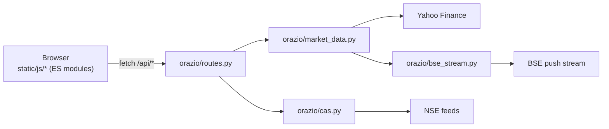

# Orazio

A free, open-source TradingView alternative — self-hosted charting for Indian and global indices, live quotes plus historical candles, backed by Yahoo/NSE/BSE's own public endpoints instead of a paid data plan. Runs on your machine. No login, no account, no API keys, nothing to pay for.

**Why this exists:** TradingView put a ~15-minute delay on Indian market data for free-tier users, so traders got pushed toward a paid subscription just to see a live price. Orazio hits the exchanges' own feeds directly and skips that entirely.

## Features

- Live candles + full historical data — intraday and daily bars, drag left to load older days, not just the current session.
- SENSEX real-time from BSE's own push stream (Yahoo delays it ~15 min).
- CAS terminal: countdown panel, live 4-quadrant movement view, and a stock-by-stock auction feed with order books (pre-open and closing auction).
- Charting: 11-index rail, candles/bars/line/area, SMA 20/50/200, volume, symbol search, a two-point measure tool.
- Market breadth and Top Movers (gainers/losers) across NIFTY, BANK NIFTY, SENSEX, DOW, S&P 500, CSI 300.
- Data-age badge (`Live · 3s`, `Delayed 10m`, `Closed`) so a stale feed never looks like a broken app.
- Cash/futures toggle and options chains for US symbols; light mode.

**Not real-time:** US/KOSPI/TAIEX/CSI 300/Shanghai indices (Yahoo only, no push feed available), ES/NQ/YM futures (~10 min delayed via CME), and NSE's own indicative index ticks (~1/min). Full breakdown below.

## Quick start

```bash
pip install -r requirements.txt
python app.py        # then open http://localhost:5000
```

## Where each index's data comes from

Measured on Mon 21 Sep 2026.

| Index | Live price | Age | Call-auction data |
|---|---|---|---|
| NIFTY 50, BANK NIFTY, NIFTY IT | Yahoo tick (NSE feed for the official close) | 1–5 s | NSE per-stock feed, ~50 s snapshots; index indicative ~1/min |
| SENSEX | BSE push stream (REST fallback) | 2–3 s | BSE stream, real-time |
| S&P 500, Nasdaq, Dow | Yahoo | not measured (US closed) | none public |
| KOSPI, TAIEX, CSI 300, Shanghai | Yahoo | none at close | none found |
| ES=F, NQ=F, YM=F futures | Yahoo (CME) | **~10 min delayed** | n/a |

Notes: `NQ=F` is Nasdaq-100, not the Composite. Candle history comes from Yahoo everywhere except SENSEX, where the recent bars are built from BSE's stream. After the auction Yahoo's NIFTY tick goes stale (it stopped at 15:17:32, showing 23429.00 against an official close of 23414.30), so NSE's index feed supplies the close.

## What is not real-time

- NSE only refreshes its indicative index values about once a minute, so the NIFTY-family CAS charts are stepped. SEBI has proposed dropping those values altogether.
- Free sources tick about every 11 s at best; sub-second data needs a paid or broker feed.
- The US, Korean, Taiwanese and Chinese indices have no public auction feed.

## How it fits together

Everything runs as one local process: the Flask server serves the page, answers `/api/*`, and polls the exchanges in background threads. Nothing is written anywhere but your own disk (a small seed file, so the CAS reference price survives a restart).



**Backend** (`orazio/`) — one module per concern:

| Path | Purpose |
|---|---|
| `app.py` | Thin entry point — creates the app and runs the dev server |
| `orazio/__init__.py` | App factory: wires the Flask app, CORS, and blueprint together |
| `orazio/config.py` | Environment-driven settings (debug, host, port) |
| `orazio/constants.py` | Static lookup tables (symbol aliases, ranges, CAS session windows, …) |
| `orazio/symbols.py` | Symbol validation and interval/range resolution |
| `orazio/candles.py` | Shapes yfinance OHLCV data into API rows |
| `orazio/market_data.py` | Live quote sources (Yahoo/BSE/yfinance/NSE) and the live-bar aggregator built on them |
| `orazio/cas.py` | Call Auction Session: phase/session logic, NSE index polling, reference-price calc, feed normalization; also NSE-native market breadth for NIFTY/BANK NIFTY/NIFTY IT |
| `orazio/constituents.py` | Self-computed breadth AND top movers for SENSEX/DOW/S&P 500/CSI 300 from one shared batched fetch of their own constituents (Wikipedia-scraped lists for the two big ones — not hand-typed); feeds both `/api/breadth` and `/api/movers` |
| `orazio/movers.py` | Top gainers/losers by universe (whole market, NIFTY, BANK NIFTY) — `/api/movers` |
| `orazio/nse_client.py` | Shared cookie-authenticated NSE JSON fetcher |
| `orazio/bse_stream.py` | BSE Socket.IO client, TLS verified against the missing intermediate certificate |
| `orazio/poller.py` | Starts every background thread exactly once |
| `orazio/routes.py` | HTTP routes — thin glue over the modules above |

**Frontend** (`static/js/`) — no build step, plain ES modules loaded by the browser:

| Module | Purpose |
|---|---|
| `state.js` | Shared app state, formatters, design tokens (recomputable — see `refreshColors()`) |
| `chart.js` | Lightweight-Charts setup, series, indicators, legend, theme reapplication |
| `data.js` | Candle loading, history lazy-load, live quote polling |
| `symbol.js`, `rail.js`, `futures.js`, `options.js` | Symbol search, the index rail (incl. breadth counts), the cash/futures toggle, the options modal |
| `cas-panel.js`, `cas-movement.js`, `cas-feed.js` | The CAS terminal: countdown panel, live movement modal, stock-by-stock feed |
| `measure.js` | Two-point measure tool (click two points for Δ price/%/time) |
| `movers.js` | Top Gainers/Losers modal |
| `theme.js` | Light/dark theme toggle |
| `ui.js`, `prefs.js`, `main.js` | Generic UI helpers, saved preferences, boot + control wiring |

Other paths:

| Path | Purpose |
|---|---|
| `static/index.html`, `static/styles.css` | Markup and design tokens |
| `tests/` | Unit tests for the pure logic (symbol validation, range resolution, CAS phase calc, …) |

## Limits

- Yahoo, NSE and BSE endpoints are the ones their own websites call, not supported APIs. Any can change or block, and the app falls back rather than erroring. A personal charting tool, not a trading-grade feed.
- NIFTY-family candles end at 15:14 (Yahoo has no bars during the auction); the closing value shows in the price.
- Runs on Flask's development server. Don't expose it to the internet.

## Disclaimer

This tool is for informational and educational purposes only. It is not a replacement for real tick data, a licensed market data feed, or professional trading advice, and it is not a basis for real trading decisions. You are solely responsible for your own financial decisions and any consequences of using this software. The app's accuracy, latency and uptime are entirely dependent on the free, unofficial Yahoo/NSE/BSE endpoints it polls — they can change, throttle or go down without notice. This project is provided as-is, with no warranty or guarantee of any kind.

## Roadmap

- Corporate actions (splits, bonuses, dividends) currently aren't adjusted for, so candle history can show a discontinuity across an ex-date — needs a proper adjustment pass.
- Global market data sources (a real feed for US/Korea/Taiwan/China beyond plain Yahoo) are a work in progress — no free, accurate source found yet. Indian markets are the priority for now, since that's what I actively trade.
- Assorted QoL bug fixes as they turn up.
- No guarantees on timeline — maintained as time allows, with no warranty of fitness for any purpose.
