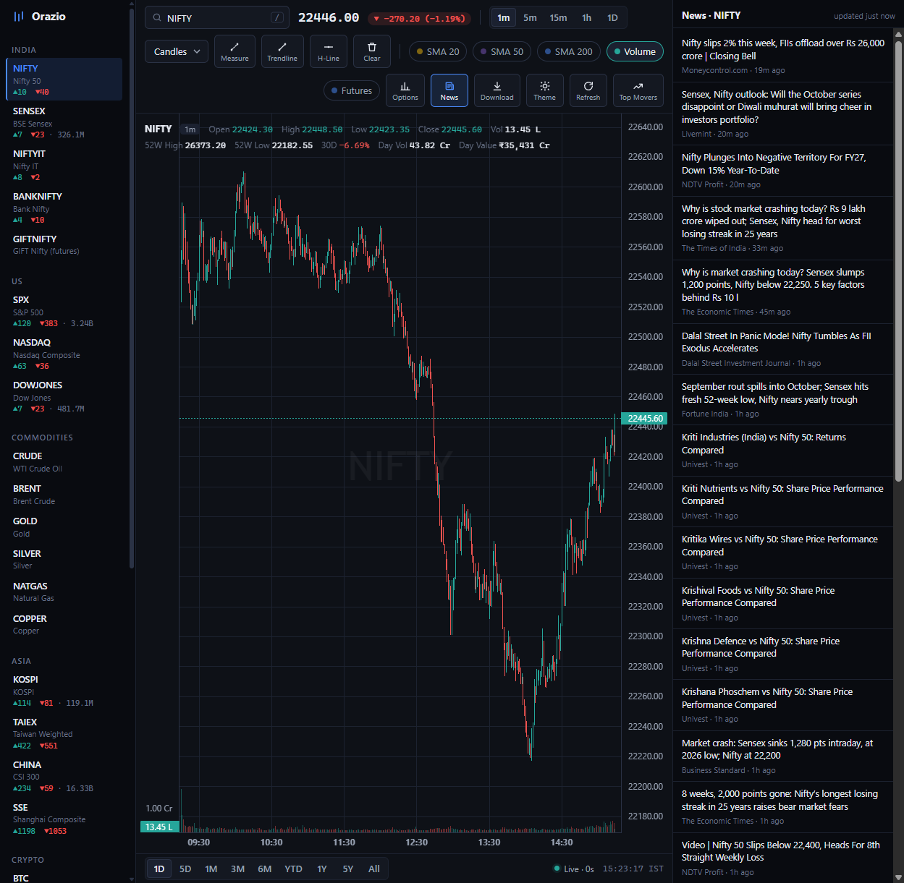

<p align="center"></p>
<h1 align="center">Orazio</h1>

**A free, self-hosted TradingView alternative for Indian and global markets.**
Real exchange data (NSE, BSE, Binance), live Closing Auction Session (CAS) terminal, options, news. No login, no API keys, nothing to pay for.



> **Educational and informational project.** Orazio is not a replacement for live exchange data feeds or premium trading tools, and nothing it shows is financial advice. Data can be delayed, wrong or missing. Use it at your own risk.

## Quick start

```bash
pip install -r requirements.txt
python app.py          # open http://localhost:5000
```

## Features

- **Live charts** — candles, bars, line, area; 1m–1D bars; SMA 20/50/200; volume; drag back for older days; light/dark. Prices are pushed to the page (SSE), not polled.
- **Closing Auction Session (CAS) terminal** — countdown, live NIFTY / BANKNIFTY / NIFTY IT / SENSEX movement, and a stock-by-stock auction feed with order books.
- **Options** — NSE futures table and option chain (OI, IV, PCR, max pain, straddle) for NIFTY, BANKNIFTY and ~213 F&O stocks; Yahoo chains for US stocks. Chart the front-month future in place of spot.
- **Commodities, real time** — gold, silver, crude, Brent, gas, copper from Binance perpetuals (sub-second). One click switches to Yahoo's CME futures (~10 min late).
- **SENSEX in real time** from BSE's own push stream. **GIFT Nifty** with history back to 2023.
- **Market breadth and Top Movers** for the major indices, in the left rail.
- **Drawing tools** (trendline, H-line, measure) anchored to price and time, so they survive pan, zoom and reload.
- **News panel**, company names, 52-week stats, live index volume.
- **Download** OHLCV as CSV/Parquet, or schedule an end-of-day export.

## Where the data comes from

| Market | Source | Latency |
|---|---|---|
| NIFTY, BANKNIFTY, NIFTY IT | Yahoo tick, NSE for the official close | 1–5 s |
| SENSEX | BSE push stream | ~1 s |
| Commodities | Binance websocket (Yahoo CME optional) | <1 s (Yahoo ~10 min) |
| NSE futures, options, GIFT Nifty | NSE / NSE IX public endpoints | ~1 min |
| US, Korea, Taiwan, China indices | Yahoo / Sina / Naver / TWSE | seconds |
| NSE auction (CAS) | NSE public feed | ~54 s (measured) |

## Honest limits

- Uses the same public endpoints the exchanges' own websites call, not supported APIs. Any can change or block; the app falls back instead of erroring.
- NSE's auction data updates about once a minute. Anything faster needs a broker feed, which Orazio avoids on purpose.
- Binance commodity prices are perpetuals, not the CME/MCX contract: close to spot, but gold and silver can sit ~0.5% off futures. Use the Yahoo switch for the CME price.
- Indian commodities (MCX) aren't available: MCX blocks scripted access and NSE has no commodity feed.
- Flask dev server. Don't expose it to the internet.

## Tests

```bash
python -m pytest        # ~500 backend tests, ~2 s, no network
npm test                # frontend logic, Node's built-in runner
python scripts/smoke.py # live-feed check against a running server
```

[tests/README.md](tests/README.md) maps each feature to its tests.

## How it works

One local Flask process serves the page, answers `/api/*` and polls the exchanges in background threads. Frontend is plain ES modules, no build step.

```
orazio/            backend: one module per concern (market_data, cas, fno, commodities, quotes, ...)
orazio/routes/     HTTP routes, one file per feature area
static/js/         frontend modules; *-policy.js and format.js are pure and unit-tested
tests/  scripts/   pytest + node tests, live smoke script
```
